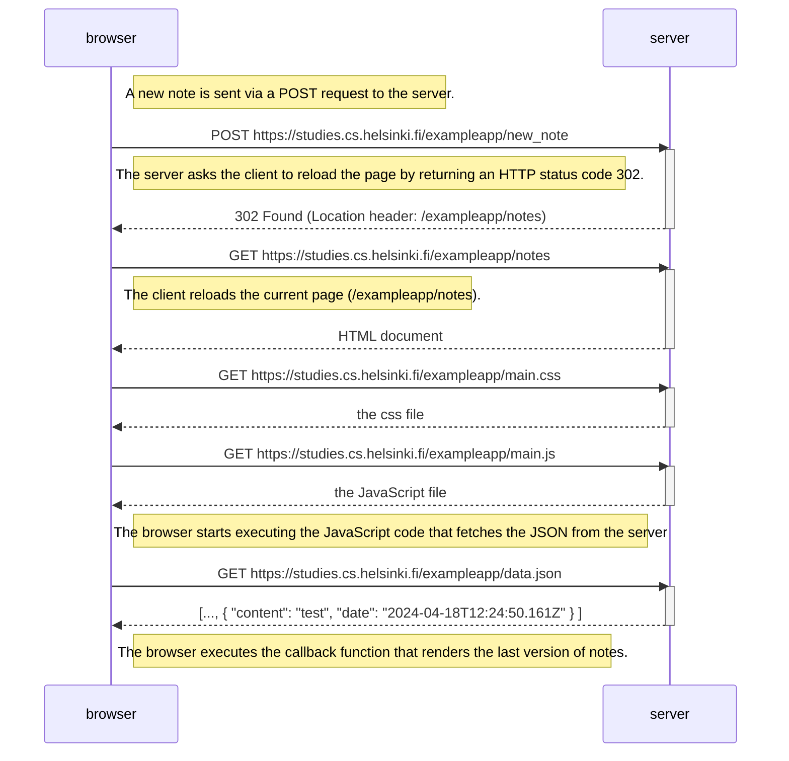

```mermaid
sequenceDiagram
participant browser
participant server

Note right of browser: A new note is sent via a POST request to the server.
browser->>server: POST https://studies.cs.helsinki.fi/exampleapp/new_note
activate server
Note right of browser: The server asks the client to reload the page by returning an HTTP status code 302.
server-->>browser: 302 Found (Location header: /exampleapp/notes)
deactivate server

browser->>server: GET https://studies.cs.helsinki.fi/exampleapp/notes
activate server
Note right of browser: The client reloads the current page (/exampleapp/notes).
server-->>browser: HTML document
deactivate server

browser->>server: GET https://studies.cs.helsinki.fi/exampleapp/main.css
activate server
server-->>browser: the css file
deactivate server

browser->>server: GET https://studies.cs.helsinki.fi/exampleapp/main.js
activate server
server-->>browser: the JavaScript file
deactivate server

Note right of browser: The browser starts executing the JavaScript code that fetches the JSON from the server

browser->>server: GET https://studies.cs.helsinki.fi/exampleapp/data.json
activate server
server-->>browser: [..., { "content": "test", "date": "2024-04-18T12:24:50.161Z" } ]
deactivate server

Note right of browser: The browser executes the callback function that renders the last version of notes.
```